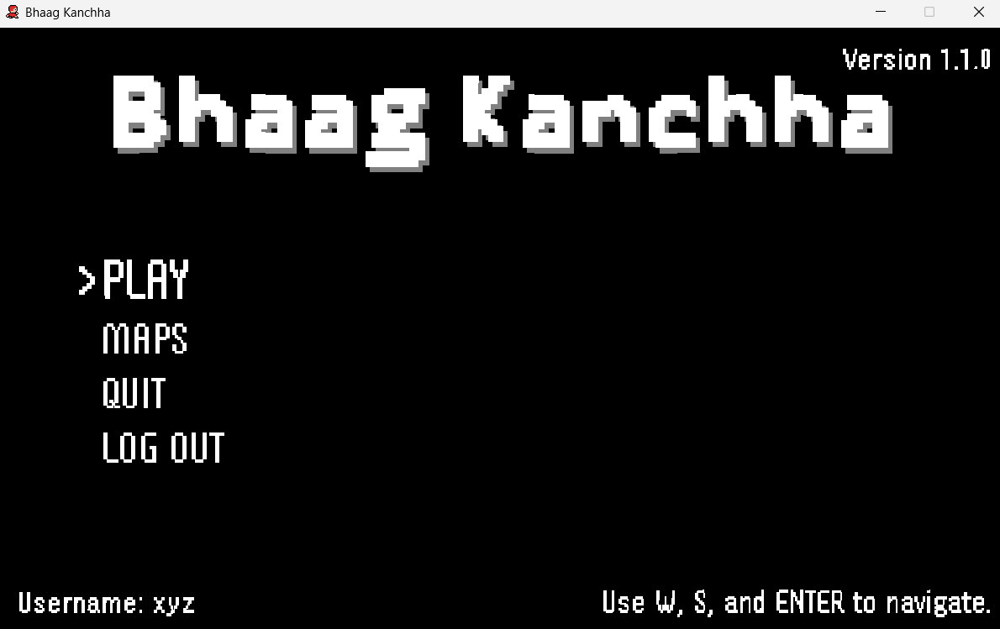
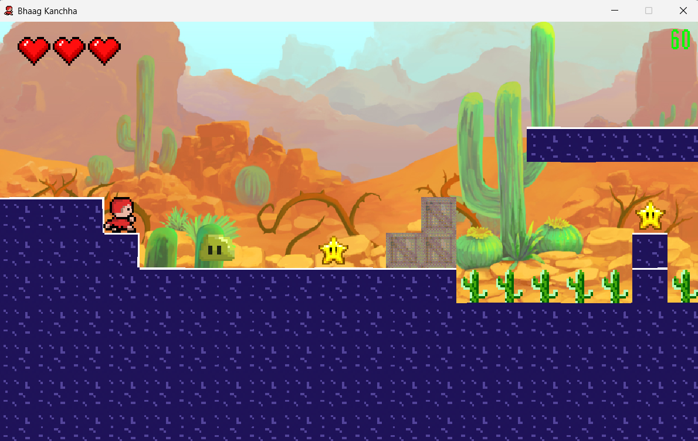
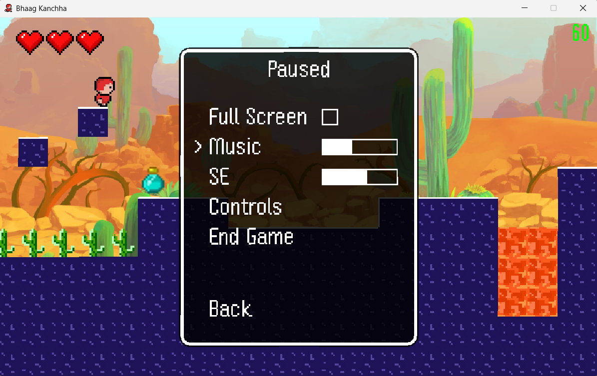

# Bhaag Kancha

A retro-style 2D survival game built using **Java Swing**. No game engine, just a bunch of code to make you jump over lava and avoid cacti. Simple, fun, and made with love (almost).  

## Built With
- **Language:** Java
- **Framework:** Java Swing
- **Database:** SQLite3

## How to Run
### 1. **Clone the repo:**  
   ```sh
   git clone https://github.com/xyzeep/BhaagKanchha.git
   cd BhaagKancha
   ```

### 2. Compile & Run (Eclipse IDE recommended):
  Run `build.bat` followed by `run.bat` or use your IDE to run the game.
  
## Folder Structure
```
/BhaagKanchha
├───res
│   ├───db
│   ├───font
│   ├───maps
│   ├───npc
│   ├───object
│   ├───player
│   ├───screenshots
│   ├───sound
│   └───tiles
└───src
    ├───entity
    ├───main
    ├───object
    └───tile
```
## Screenshots  
  

